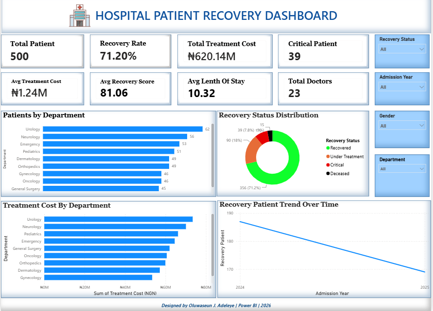

# 🏥 Hospital Patient Recovery Dashboard

## Dashboard Preview



---

## Project Overview

This interactive Power BI dashboard analyzes hospital patient recovery data to help healthcare management monitor patient outcomes, treatment costs, departmental performance, and overall hospital efficiency.

The dashboard provides actionable insights into patient recovery trends and supports data-driven decision-making.

---

## Key Performance Indicators (KPIs)

- Total Patients
- Recovery Rate
- Total Treatment Cost
- Critical Patients
- Average Treatment Cost
- Average Recovery Score
- Average Length of Stay
- Total Doctors

---

## Dashboard Visualizations

- Patients by Department
- Recovery Status Distribution
- Treatment Cost by Department
- Recovery Trend Over Time

---

## Key Insights

- Over 70% of patients successfully recovered.
- Some departments handled significantly more patients than others.
- Treatment costs varied across departments.
- Critical patients represented a relatively small percentage of total admissions.
- Recovery trends can help hospital management monitor treatment effectiveness over time.

---

## Tools Used

- Microsoft Power BI
- Power Query
- DAX
- Data Modeling
- Microsoft Excel

---

## Skills Demonstrated

- Data Cleaning
- Data Modeling
- DAX Measures
- Dashboard Design
- Healthcare Analytics
- Business Intelligence
- Data Storytelling

---

## Repository Structure

```
Hospital-Patient-Recovery-Dashboard
│
├── Hospital-Patient-Recovery-Dashboard.pbix
├── dashboard.png
└── README.md
```

---

## Author

**Oluwaseun J. Adeleye**

Aspiring Data Analyst

LinkedIn:
www.linkedin.com/in/oluwaseun-adeleye

GitHub:
https://github.com/Jamoh-analytics
